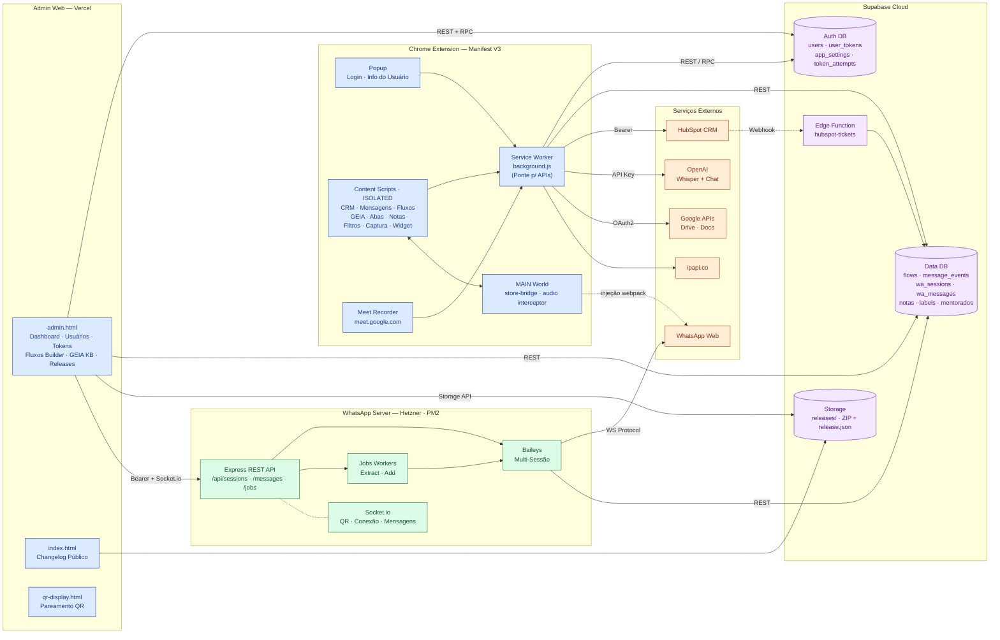
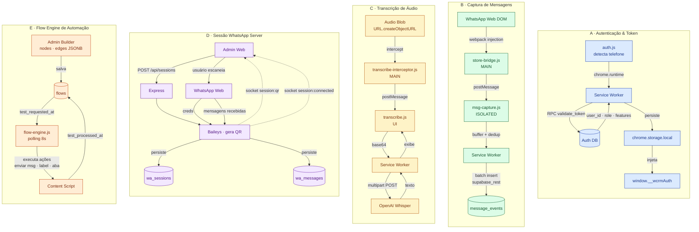
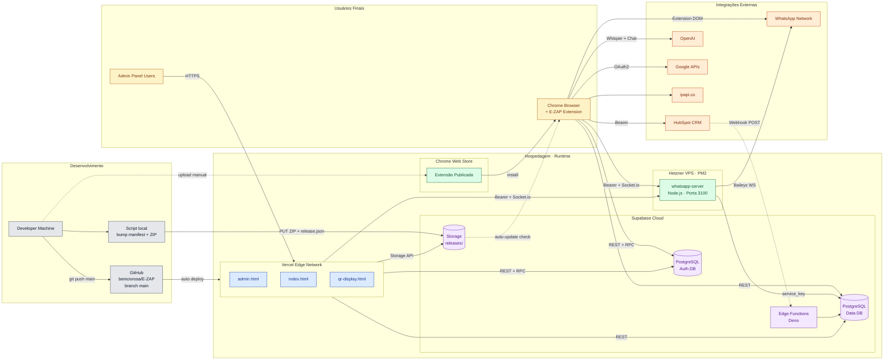

# E-ZAP — Arquitetura

**E-ZAP** é uma Chrome Extension (Manifest V3) que transforma o WhatsApp Web em uma plataforma de gestão integrada com CRM, mensagens automáticas, fluxos de automação, IA (GEIA), transcrição de áudio, captura de eventos e anotações. A solução completa é composta por quatro grandes blocos: a **extensão Chrome**, o **painel administrativo web** (hospedado na Vercel), um **servidor Node.js multi-sessão** (Baileys, rodando em VPS com PM2) e o **Supabase** como backend unificado (PostgreSQL, Edge Functions e Storage).

---

## 1. Arquitetura Geral

Visão macro de todos os subsistemas, seus módulos principais e integrações externas.



### Responsabilidades por camada

| Camada | Responsabilidade |
|---|---|
| **Chrome Extension** | UI injetada no WhatsApp Web (CRM sidebar, widget, abas, filtros), captura de eventos DOM, automação, transcrição, IA. O `background.js` é o único ponto que fala com APIs externas. |
| **Admin Web (Vercel)** | Painel administrativo para gestão de usuários, tokens, fluxos (builder visual), GEIA knowledge base, releases e analytics. |
| **WhatsApp Server** | Servidor Node.js paralelo à extensão para operações que exigem sessão persistente: multi-conta, envio/recebimento em background, operações em grupos (extração de links, adição em lote). |
| **Supabase** | Backend unificado — duas bases PostgreSQL (auth e dados), Storage para releases, Edge Functions para webhooks. |
| **Serviços Externos** | HubSpot (CRM), OpenAI (Whisper + Chat), Google (Drive/Docs para pipeline do Meet), ipapi.co (geo). |

---

## 2. Fluxo de Dados entre Módulos

Os cinco fluxos críticos que atravessam múltiplos subsistemas.



### Observações sobre os fluxos

- **Fluxo A** — a validação usa device fingerprinting (`token_attempts`) e recupera `features` por perfil (crm, msg, abas, geia, fluxos, buttons).
- **Fluxo B** — a bridge `store-bridge.js` roda no MAIN world para acessar `window.Store` via webpack injection; `msg-capture.js` roda no ISOLATED world e se comunica por `postMessage`. Eventos são deduplicados por `message_wid` e enviados em batch.
- **Fluxo C** — três APIs do browser são interceptadas (`URL.createObjectURL`, `HTMLMediaElement.play`, `AudioContext.decodeAudioData`). O blob é convertido em base64 e enviado ao Whisper via `background.js`.
- **Fluxo D** — Baileys usa o protocolo Signal+Noise do WhatsApp (sem API oficial). As credenciais são persistidas como JSONB na tabela `wa_sessions`, permitindo reconexão sem novo QR.
- **Fluxo E** — o admin aciona testes manuais via `test_requested_at`; o content script faz polling a cada 8s e executa o fluxo localmente, marcando `test_processed_at` ao finalizar.

---

## 3. Infraestrutura e Deploy

Hospedagem, integrações externas e os dois canais de distribuição da extensão (Chrome Web Store + auto-update via Supabase Storage).



### Pipelines de deploy

| Alvo | Gatilho | Destino |
|---|---|---|
| **Admin Web** (admin.html, index.html, qr-display.html) | `git push origin main` | Vercel (auto-deploy) |
| **Chrome Extension** (versão pública) | Upload manual do ZIP | Chrome Web Store |
| **Chrome Extension** (auto-update interno) | Script local: bump manifest → ZIP → PUT Storage → patch `release.json` | Supabase Storage `releases/` |
| **WhatsApp Server** | Deploy manual (pull + `pm2 restart`) | Hetzner VPS (PM2, porta 3100) |
| **Supabase Migrations** | Management API | Supabase PostgreSQL |
| **Edge Functions** | Supabase CLI / Management API | Supabase Edge Runtime (Deno) |

### Regras operacionais (do CLAUDE.md)

- Toda edição na extensão **deve bumpar `version`** no `chrome-extension/manifest.json`.
- Textos de UI em PT-BR **sempre com acentos**.
- SQL de migration salvo em `supabase/migration_XXX_descricao.sql`.
- Management API do Supabase deve enviar `User-Agent: Mozilla/5.0 ...` (Cloudflare bloqueia UAs de bot).

---

## Stack Resumida

| Camada | Tecnologia |
|---|---|
| **Extensão** | Vanilla JS · Manifest V3 · Service Worker · Content Scripts (ISOLATED + MAIN) |
| **Admin Web** | HTML + Vanilla JS + Charts.js · Hospedagem Vercel |
| **Servidor WhatsApp** | Node.js · Express 4 · Socket.io 4 · Baileys 6.7 · Pino · PM2 |
| **Banco de Dados** | Supabase — PostgreSQL + RLS + RPC |
| **Edge Functions** | Supabase Functions (Deno) |
| **Storage** | Supabase Storage (bucket `releases/`) |
| **Integrações** | HubSpot · OpenAI (Whisper + Chat) · Google APIs (Drive + Docs) · ipapi.co |
| **Hosting** | Vercel · Hetzner VPS · Supabase Cloud · Chrome Web Store |
| **Versionamento** | GitHub (`beniciorosa/E-ZAP`, branch `main`) |

---

## Principais diretórios

```
zap1/
├── chrome-extension/        # Extensão Manifest V3 (background, content scripts, popup)
│   ├── manifest.json        # v1.9.97 — permissões, host_permissions, OAuth2
│   ├── background.js        # Service Worker — única ponte para APIs externas
│   ├── content.js · msg.js · slice.js · abas.js · notes.js · geia.js · ...
│   ├── store-bridge.js      # MAIN world — acesso a window.Store
│   └── transcribe-interceptor.js  # MAIN world — hook em audio APIs
│
├── whatsapp-server/         # Servidor Node.js Baileys (Hetzner · PM2)
│   ├── src/
│   │   ├── index.js         # Entry — Express + Socket.io
│   │   ├── routes/          # sessions · messages · jobs
│   │   ├── services/        # baileys · supabase · jobs
│   │   └── middleware/      # auth (Bearer)
│   └── package.json         # express · socket.io · baileys · pino · dotenv
│
├── admin.html               # Painel admin (Vercel) — ~6488 linhas
├── index.html               # Changelog público (Vercel)
├── qr-display.html          # Página QR para pareamento
├── vercel.json              # CORS para /api/*
│
├── supabase/
│   ├── functions/
│   │   └── hubspot-tickets/ # Edge Function Deno — webhook receiver
│   └── migration_*.sql      # Migrations versionadas
│
└── CLAUDE.md                # Regras e credenciais do projeto
```
